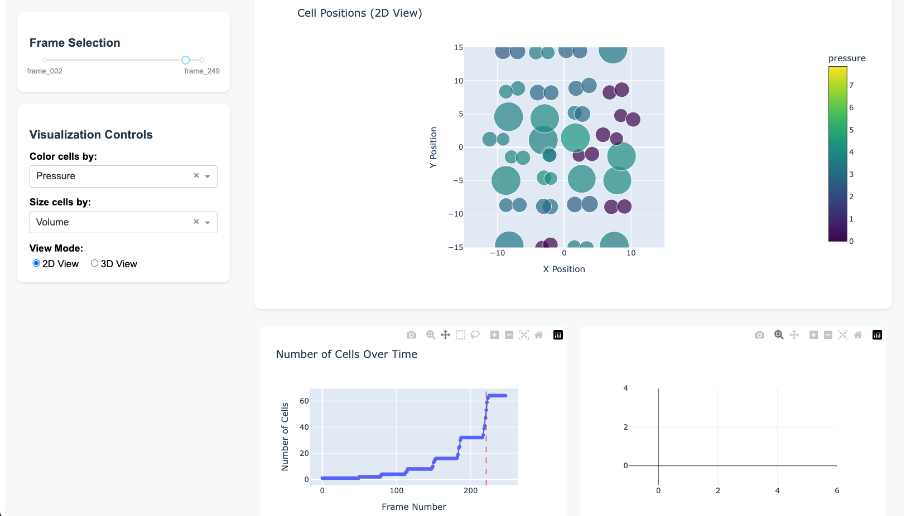

# Goo Visualization Dashboard

An interactive visualization dashboard for Goo simulation data, built with Dash and Plotly.




## Installation

Install directly from GitHub:

```bash
pip install -e git+https://github.com/yourusername/gooviz.git
```

## Usage

Run the dashboard with:
```bash
python -m gooviz.cli path/to/your/data.h5 --debug --port 8050
```

### Command Line Arguments

- `--debug`: Enable debug mode (default: False)
- `--port`: Specify the port number (default: 8050)

### Controls

- **Frame Selection**: Use the slider to navigate through simulation frames
- **View Mode**: Toggle between 2D and 3D views
- **Color By**: Choose between volume or pressure for cell coloring
- **Size By**: Choose between volume or pressure for cell sizing

## Development

### Project Structure

```
goo-visualization/
├── src/
│   └── gooviz/
│       ├── __init__.py
│       ├── cli.py
│       ├── data_loader.py
│       └── visualizer.py
├── examples/
│   └── out.h5
├── pyproject.toml
└── README.md
```

## License

This project is licensed under the BSD 3-Clause License - see the LICENSE file for details.

## Acknowledgments

- Built with [Dash](https://dash.plotly.com/) and [Plotly](https://plotly.com/)